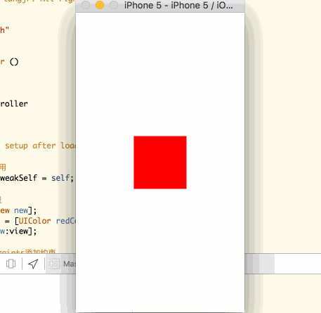
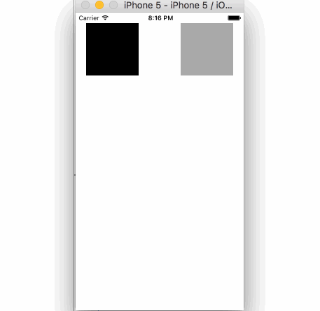
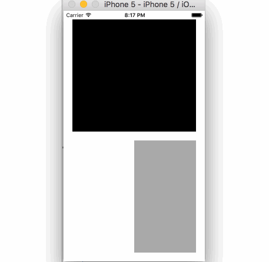
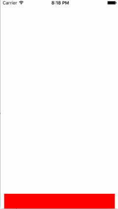

# MasonryDemo
自动布局Masonry案例

详细介绍请看：

>   [Masonry使用案例讲解](http://www.saitjr.com/ios/ios-masonry-demo.html)

## ViewController1

无论在什么尺寸的设备上（包括横竖屏切换），红色view都居中显示。

## ViewController2

1.  无论在什么尺寸的设备上（包括横竖屏切换），黑色view的左、上边距、大小都不变；
2.  灰色view的右边距不变
3.  宽、高、上边距黑色view相等

## ViewController3

1.  有两个view，黑色与灰色；
2.  黑色view的左、上、右边距均为20，下边距灰色view 20，宽度自适应，高度与灰色view平分整个界面；
3.  灰色view宽度为黑色view的一半（即左边以中线起始），右、下边距与黑色view相同，高度与黑色view相同。

## ViewController4

当键盘挡住输入框时，输入框自动向上弹到键盘上方。

